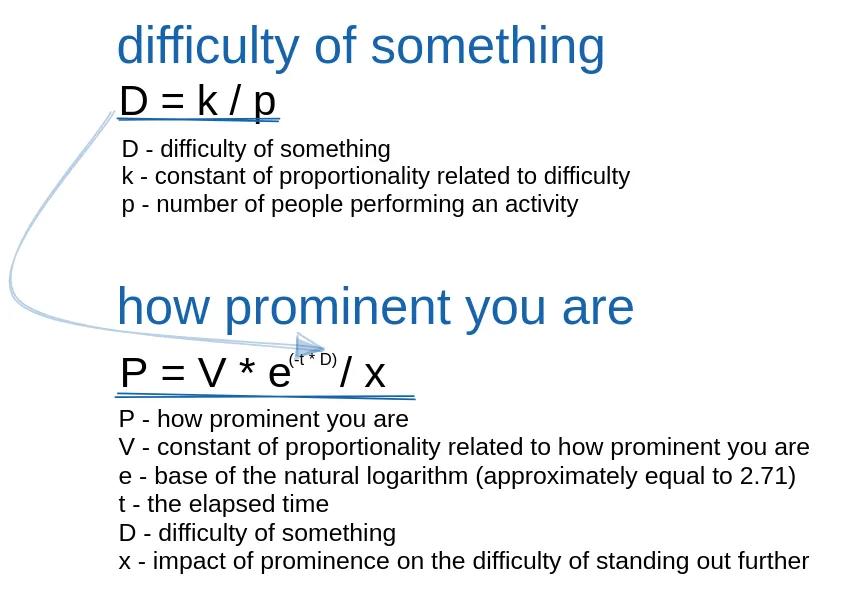
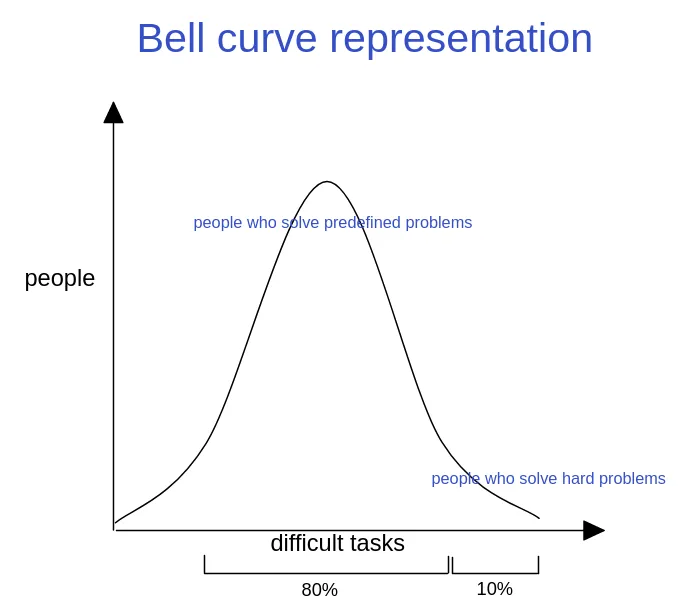

The purpose of this post is not to attack anything or anyone; I will simply be presenting and trying to prove ideas based on the experience and knowledge I possess.

---

I begin this article with a simple provocation: what is your differentiating factor? Think about it... it must be something truly unique, something that few people have/do.

You probably struggled to answer that question; it's really difficult, considering various factors that must be taken into account. I wouldn't know how to answer it very well myself. So, let me pose other questions to help us find the answer: What do you do to stand out among the rest? Do you find it difficult to stand out? And if I told you that it's easy in the vast majority of moments, would you believe me? The difficulty actually starts at the 10% mark; until then, it's relatively easy. By doing things correctly, you easily stand out and quickly reach the top 10%.

Luckily, it's easy to get there because not many people are interested. Most people worry about everyday things, about basic things that everyone does, and that's why few stand out. Stop and think... where is the difficulty in doing what everyone else does? You just have to follow them and go through all the steps they took to get where they are. Getting into college is easy, taking exams is easy, doing assignments is easy, living a normal life is easy... How many people do that? All these steps have detailed instructions on what you should do at a certain moment and how to achieve a specific goal. You already have the solution in your hands. How do you want to become someone exceptional? It's impossible.

You stand out when you solve real problems, the ones everyone avoids, when you do things that few people do, things that many find tedious, unnecessary, or that they wait for the right time to do. That's the biggest "absurdity" ever invented. Stop avoiding things!

I will present some data and make assumptions based on my understanding that I believe to be true and should be taken into consideration. Here are some crucial points:

The difficulty of something is related to the number of people doing it. The more people do it, the easier it becomes.

The speed at which you stand out is inversely proportional to the number of people not doing it and exponentially proportional to the passage of time.

The difficulty of standing out is proportional to your position at the top. The higher the position, the greater the difficulty.

To simplify, we can create a mathematical operation to represent this:

The formula represents a synergistic relationship between the difficulty of an activity and the speed at which someone stands out in that activity. **The more people engage in an activity, the lower the difficulty due to the ease provided by the availability of resources and information. On the other hand, the more someone stands out in an activity, the harder it becomes to stand out even further due to intensified competition.**

Now, here's the great insight: scaling this formula is extremely easy in the current context we live in. Because of the large number of people p doing easy and common things, the constant k has a high value, resulting in a low value for difficulty D. Let's look at the numbers: in this mentioned case, the formula becomes difficult to scale due to the variable D having a low value. However, if you do something different, something that few people do, the variable D will be higher, and consequently, your prominence will also be greater. Moreover, the fewer people are doing something, the higher the level of difficulty, and therefore, the greater your prominence.

- Difficulty and the number of people are inversely proportional.
- Difficulty and prominence are exponentially proportional.

Once you engage in activities with a high level of difficulty D time becomes a crucial element in the formula. Just maintain consistency, always seeking more challenging tasks, so that you can scale the formula sooner or later. Stop run away from difficult things!

And why is scaling easy? Reiterating what was said before, people are very accustomed to accepting reality. Let's imagine a life where an individual finishes school, goes to college, and works. If we stop to analyze, about 95% of their days are already predetermined, from what they should study to what they need to do to become a professional, and even how to handle situations at work. In other words, many things are already established. The other 5% of their days are where they deal with more challenging problems, and that's where their prominence increases. I would say that about 80% of people are like that.

Therefore, when you increase the percentage of difficult problems you solve throughout your life, you increase your prominence, and that's how you stand out from the rest. When you reach the 10% mark where the difficulty starts to become high, you'll be competing with intelligent people. The ones with the best ideas, the best insights, and the ones who seek the most will be victorious. That's when the competition begins because until then, the competition is extremely low.

The final provocation I want to leave you with is this: **engaging in positions/professions that follow a predefined line of actions is easy; try solving real problems**
