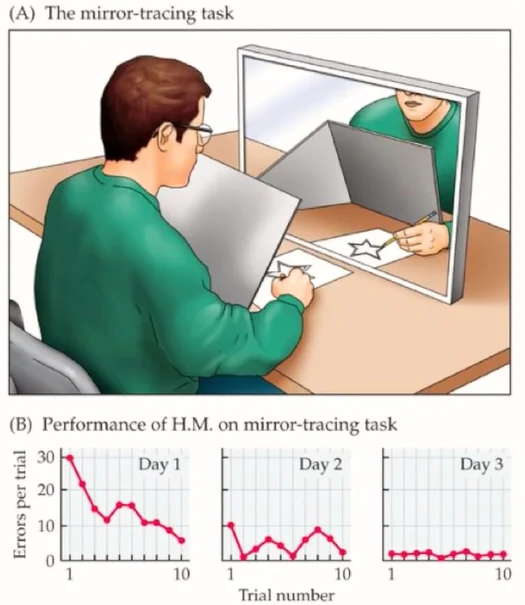
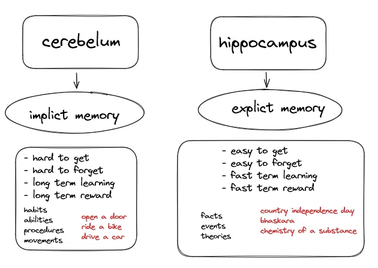
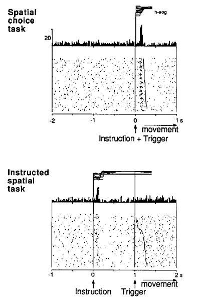
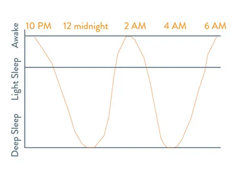

In a short explaination, memory is just living something and “storing” it. Memory exists in different contexts: computers, cellphones, libraries, humans, animals… everything that receive and store something has memory.

As humans, we use our memory for remember something and from that act on something. It may seem simple, but it’s very important nowadays. We recovery it every moment to remember how to do something, or what to do in some situations… we access memories basically for everything, including to create news memories based on what we already have.

But… have you ever wondered why you don’t lose memories like “what time should you have lunch”, “what should i do at work”, “what laws and routine should i follow”. But forget “what specifically did you have lunch yesterday”, “what did you study last week”…?

It’s happens fortunately (yes, fortunately) because our brain filters the important contents and removes memories you don’t use. Imagine having an HD full of files that you will never use, and it only weighs and interferes with performance…

The big question is **How to make the brain treat some information as important?** First we need to know that there are two types of memory:

- **Implicit**(system 1): habits, abilities, procedures, movements…
- **Explicit**(system 2): theories, facts, events…

The implict memories are basically your habits, they happen unconsciously because your neurons already have all the necessary connections to run them, correct them or increment them.

The explict memories are basically facts in you day, they happend consciously because probably you don’t make this fact as a habit so your neurons still haven’t been able to do and find reasons to create links consolidating the information.

For example, when you study from Monday to Thursday, but go to a party from Thursday to Sunday night… Your brain doesn’t find reasons to consolidate the information you learned during those four days of study, because it understands that you don’t need it that much from them.

## The implict memory

As seen above, explict memories were lost over time so I imagine you’ve already figured out that to get along you need to know how to manage your implict memory. So the best way to do this is to create habits for those memories of yours that you always want to have.

Habituation is the reduction of response after successive representations of a stimulus, that is, getting used to a situation to the point that it is worked on as something already recognizable by your subconscious. But it’s just works when you really expose yourself to live a situation, if you just stick to theory, you won’t be activating implicit memory. Habituation make your brain to store the context as implict memory whose is extremely more performative ans scalable.

A famous experiment that be prove it is “Henry performance on a mirror tracing task”. Henry is a patient that had epileptic seizures, in an attempt to stop it your hippocampus(responsible for store explict memories like facts and events) was removed from your brain and he was submitted to draw a star looking by a mirror. He was 10 attemps everyday, in three days your fails were decreasing, conclusing that your brain learned such a movement.

But the amazing part… the interviewer needed to introduce herself and explain the exercise everyday to Henry. Why? Because he didn’t he remember who was she and what he needed to do. That is, he lost the explict memory when hippocampus was removed, but it didn’t matter if Henry didn’t knew the theory or what to do, your brain was taught and made connections between neurons to know how to draw a star looking through a mirror, even Henry thinking he had never done that since lost the part that remembered the events and explicit memories! IT IS AMAZING.

You must stimulate the memory every time, if you don’t expose it you don’t have a response to your act and you don’t get used to it. The more you do something, the more you are telling your brain that this operation is important and will be stored as implicit memory.

Basically when you live something the explict and implict memory starts together it’s up to you to make the implicit memory a habit by practicing and living that memory inside a proper context. If you don’t, and leave it as an explicit memory, you’ll probably forget it.

Enjoy studying, enjoy learning, enjoy living, you MUST make your knowledges implicit. AND BINGO! If you aplly the ideia of implicit memory in study/learn acts, everything will be easier, because the action of learning/studying will become an implicit memory of you, your brain will work behind the curtains, you will retain your knowledge much better.

## How the external environment influence your memory?

The ways I’m going to talk about don’t have studies in humans that prove to increase memory, but they sure prevent long-term loss of it. Mixing all the ways that will be mentioned is the best way to have a “good memory”, if you create an ideal and comfortable context for your brain you facilitate its operations.

### Motivation

For turn something a habit you must a motivation to do it, it’s hard do something commonly without motivation. When you have motivation your brain liberate dopamine to you reach your goal, but to your brain do it you must know the bennefits from do something, you must know what you will be rewarded with.

A study made with a monkey shows how dopamine is liberated in your brain based in the reward. First the monkey just receive a apple juice and analyzing brain activity was seen that dopamine was liberated when the monkey receive the reward. But over time it was analyzed that dopamine quantity was decreasing, that is, your brain was getting used to the reward. So the scientists change the mode for that reward, now a light will be triggered before reward and analyzing brain activity was seen that dopamine was liberated before monkey receive the reward, that is, your dopamine increase when a light will be triggered to generate motivation.

The experiment is a little more complex and longer but that’s beside the point. With this information it is possible to conclude that dopamine is generated for the motivation to reach a goal.

### Sleep

Lack of sleep harms the hippocampus. The natural activity of the hippocampus is to reset unimportant information when you sleep. Mostly while deep sleep your brain will be resting and preparing you to a new day of informations. If you don’t do it, you will be exausting! Sleep 7 to 8 hours a NIGHT.

### Study

The study will make your brain exercise information and consolidate it, you recover something and refresh your memory.

### Exercises

Exercises with studying are the main protectors of neurodegenerative diseases, especially when you’re older, these acts protect you and prevent memory loss.

### Food

Having a good diet is essential to keep all the functions of your body working perfectly, your cells need proteins to work, and if something is wrong inside them it will harm all other operations. It does not influence directly, but remember having an ideal and comfortable context for your brain makes everything flow better.

You must live what do you want remember tomorow, start to living what you studying and working, what you belive, what you feeling… As Steve Jobs would say “the world belongs to the doers and not to the thinkers”.

Be a doers!

---

Reference:

[https://bokcenter.harvard.edu/how-memory-works](https://bokcenter.harvard.edu/how-memory-works)
[https://www.jneurosci.org/content/jneuro/13/3/900.full.pdf](https://www.jneurosci.org/content/jneuro/13/3/900.full.pdf)
[https://www.nestedbean.com/pages/your-babys-sleep-cycle](https://www.nestedbean.com/pages/your-babys-sleep-cycle)
