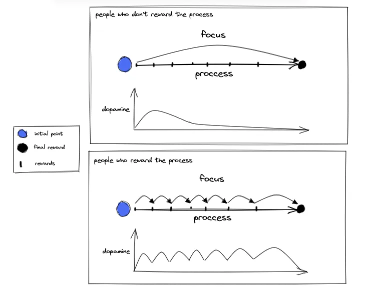
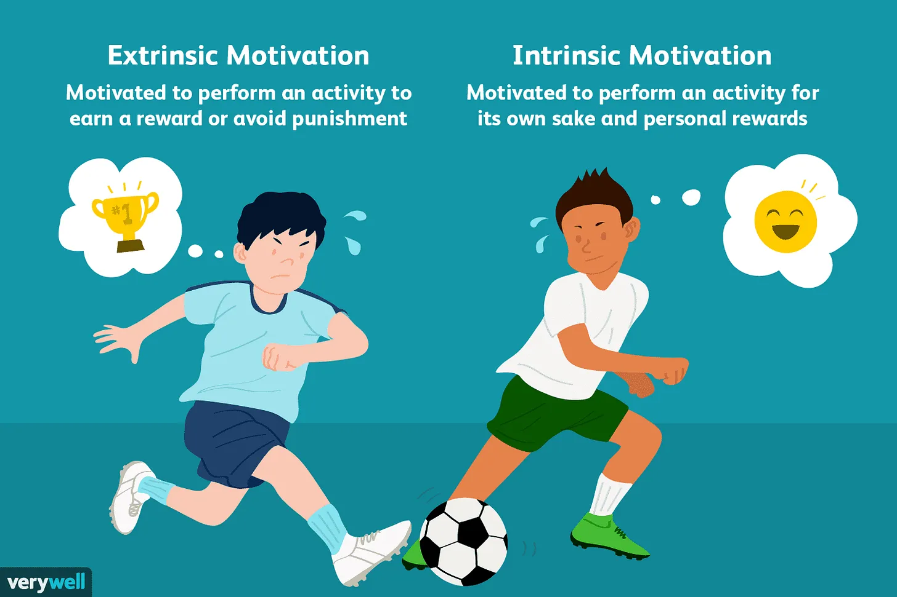

You've probably already felt unmotivated and hopeless to pursue your goals. It is extremely common and with the comfort that exists today more and more people are frustrated by having problems achieving their goals.

We all have goals, whether they are good or bad, fast or long, small or big... everyone wants something, but few manage to follow through until the end and are proud of what was built in the process. Most give up midway and change their focus, usually for one that is easier to reach.

This is not necessarily a bad thing, the perception of purpose and achievement varies from person to person, and living an ordinary life with common goals is fine and normal. This article is not intended to force you to live a life focused on studies and work, but rather to instruct you to pursue your goals correctly. Just enjoy it!

The big question is: how not lose motivation on the way to a big goal?

**_A long goal without planning is an entropic goal with a high chance of failure._**

## Breaking the goal into smaller parts

The best way to stay consistent on the way to a goal is to break it down into small goals. It’s makes you receive small rewards for achievements before actually reaching the end… makes you always focus on something, in this case on small goals, but never leaving the way to the final reward.

Dividing into small goals is extremely important for the brain to release dopamine to achieve each one of them and encourage you to go in search of the next step. For each goal received, dopamine is released to stimulate the search.

If you only see the final reward, depending on the process, you will probably get frustrated and lose motivation to achieve this.

If you break the goal into smaller pieces you will always stay motivated to reach the end point. But if you understand how to reward the process, it won't even be the main learning and reward of your journey.

**_The final reward is not the most important, learn to enjoy the process!_**

## How to learn to reward the process

You've probably experienced the situation of waiting in a queue for five minutes that seems like it took hours, and the situation of playing video games for a few minutes and passing hours...

This happens for several reasons, but it can be associated with the reward of the process.

During the queue you just want it to end, you want to get out of there.

During the game, you reward the process with fun, pleasure, entertainment, you want to never end it.

Of course, there are situations, like the queue, that there is no way to reward the process. But fetching this to everyday cases, we have a lot to learn from the process. But… how to do this?

## Break the goal and study the process benefits

You will only get the motivation to break a goal if you understand the reason for this and what it will bring.

Study what each process rewards, what can you learn from it?

A good example that everyone has already experienced is the search for a defined body. Someone who thinks only about the final reward will see as a benefit only the defined body.

But someone who learn to reward the process can understand the benefits of eating well, sleeping well, drinking water, exercising the mind... which results in greater well-being.

Someone who rewards the process performs the activity more constantly with more desire and always learns something.

## Change your enviroment

Be careful of your enviroment and how it influences and modulates your rewards.

Sometimes you're already on the right way, rewarding the process, each change is a step forward... but you live with pessimistic people, that tell that you are doing it the wrong way, started late, slow...

Avoid this enviroment and these people.

## Change your point of view

Another idea to facilitate the breakdown of goals is to reverse the point of view.

Instead of having a single goal, divide it into five, and at the end of each one you will have a great reward as a result, your dopamine will always be high, as you have short and quick goals to be achieved.

Break it down as many times as you see fit, the more the better.

Using the example mentioned earlier… Want a defined body? Be healthy and get it in return. Stop focusing on a single reward and as a whole, seek to be healthy, practice physical exercises and sleep well. Voila, you will have an aesthetically defined body.

## Demotivation

It is normal for some goals to become demotivated and, consequently, to stop looking for a reward.

If you study for five years for a test and you don't pass, you get discouraged and give up. This is normal.

Your noradrenaline increases when you perform a futile behavior, causing the glial cells to identify this noradrenaline and send messages for your brain to stop this behavior, which generates demotivation.

At that moment it is important to have divided the rewards into smaller ones so as not to get frustrated. Sometimes the test was really difficult, few vacancies and many competitors, but don't think that everything was for nothing, think about everything you learned during those years of study.
