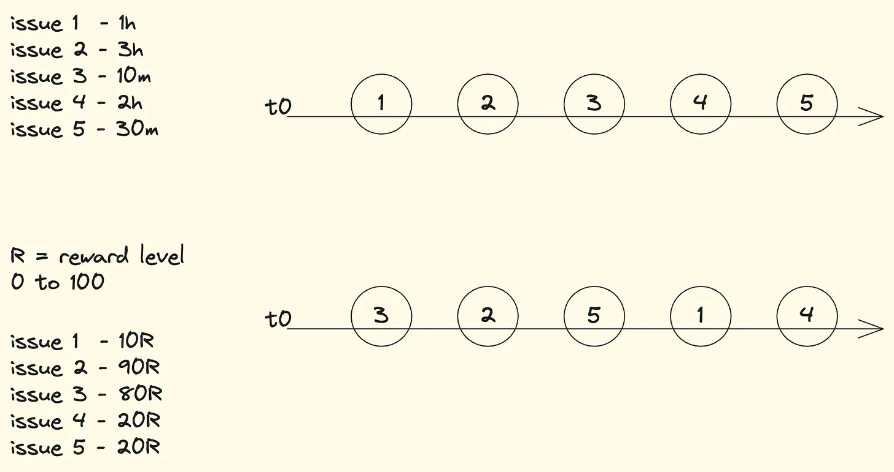
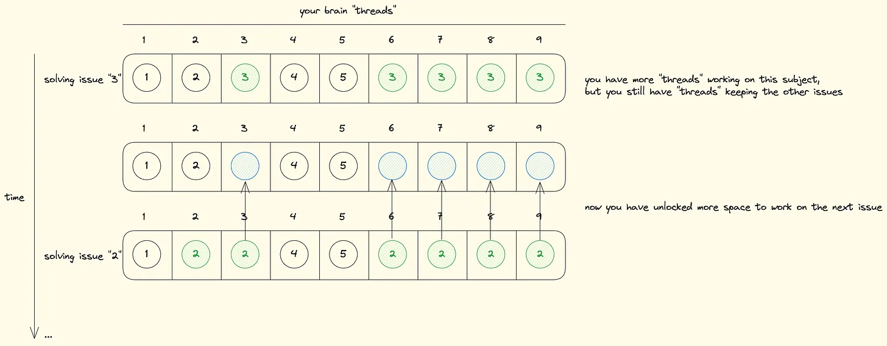
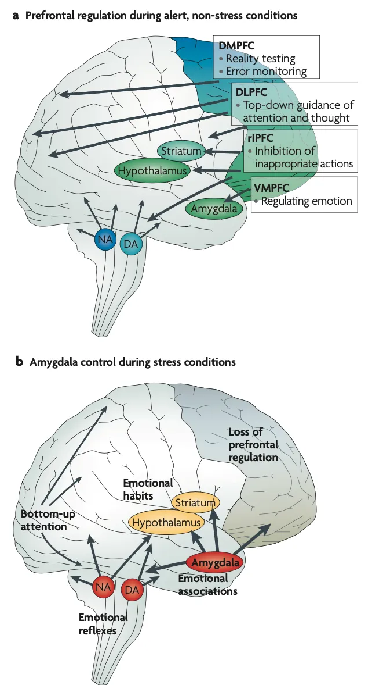

Problems are part of people's daily lives. Without problems, nothing would move forward; every action taken is aimed at solving a problem, whether it's a problem that arises daily, weekly, or even a problem you have to deal with for the rest of your life.

Problems force you out of your comfort zone; you need to take action to solve them, and this requires your attention for a period of time until it is resolved. But why do we want to solve problems? Every problem comes with a reward, and that's what we seek. Not always is this reward truly compensating in relation to the difficulty of the problem, but a reward is one less problem.

The main idea is always to have fewer problems or to have problems with a greater reward than the resources spent on them. And why is that better? Having fewer problems means less entropy in your brain; you can allocate your effort better elsewhere.

Accumulating problems is a problem in itself; you keep your brain dealing with them in the background. Imagine at some point in your day you are faced with five problems, you haven't started solving any of them yet, but you received them in a specific order: 1 - 2 - 3 - 4 - 5. You know that some problems will take longer than others, and some will reward more than others too.

You should be able to define the order of problems you will solve; it matters a lot, and it's not such a trivial task. By defining a good order of problem-solving, you achieve better performance in the next ones that will arise. My advice would be, whenever there is a problem that can be quickly resolved and brings a significant benefit, solve it first. The benchmark for defining this should also be measured by the number of problems you are dealing with. Every problem you haven't solved yet occupies a small space in your subconscious, and when you have many problems there, the stress level in your brain increases; they are directly proportional.

There are times when it is valid to focus on solving several small problems to "unlock" your subconscious. Dealing with too many things to do is stressful for your health; to better illustrate, consider these illustrations:

Not always the order in which you received the problems should be the order of solving them; sometimes it makes more sense to focus on simpler problems to reduce the level of entropy in your subconscious.

Drawing a comparison with CPUs, we can relate the way of handling tasks between your brain and CPUs:

Remember, fleeing to simpler problems is not always the solution; sometimes you actually need to face the difficult problems. Try to manage this in the correct way in your thoughts.

Having many "to-do issues" in your subconscious is terrible; a high level of stress leads to various emotional, cognitive problems and affects your decision-making. Stress amplifies bad habits; your prefrontal cortex suffers from it. See the difference between a prefrontal cortex of an individual without stress conditions and in stress conditions.

You lose the regulatory capacity of the prefrontal cortex when you are under stress; the amygdala dampens its activity. Among the harms are emotional regulation, memory, planning, behaviors...

Plan your problems and solve them wisely.

---

Reference:

[https://www.sciencealert.com/human-consciousness-could-be-a-side-effect-of-entropy-study-suggests](https://www.sciencealert.com/human-consciousness-could-be-a-side-effect-of-entropy-study-suggests)
[https://www.cnet.com/science/we-are-made-of-star-stuff-a-quick-lesson-on-how/](https://www.cnet.com/science/we-are-made-of-star-stuff-a-quick-lesson-on-how/)
[https://en.wikipedia.org/wiki/Big_O_notation](https://en.wikipedia.org/wiki/Big_O_notation)
[https://www.ncbi.nlm.nih.gov/pmc/articles/PMC2907136/](https://www.ncbi.nlm.nih.gov/pmc/articles/PMC2907136/)
